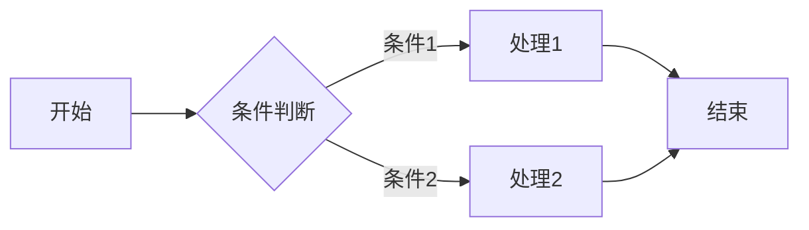
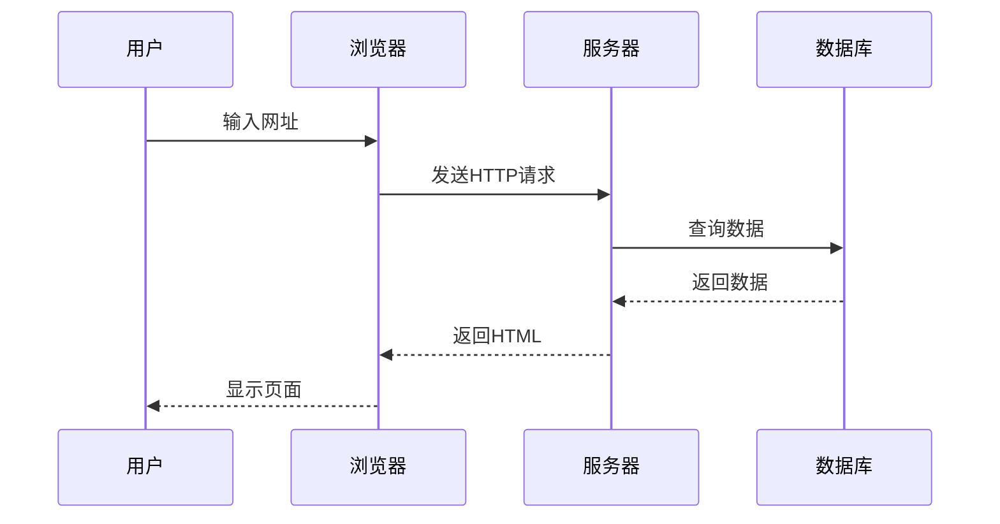
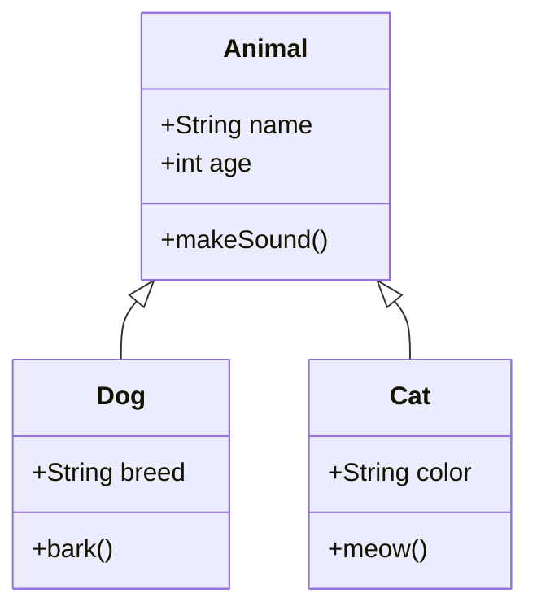
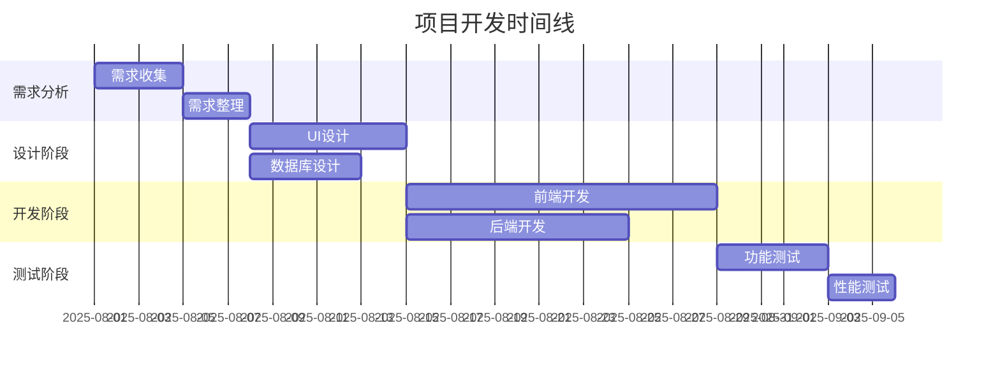
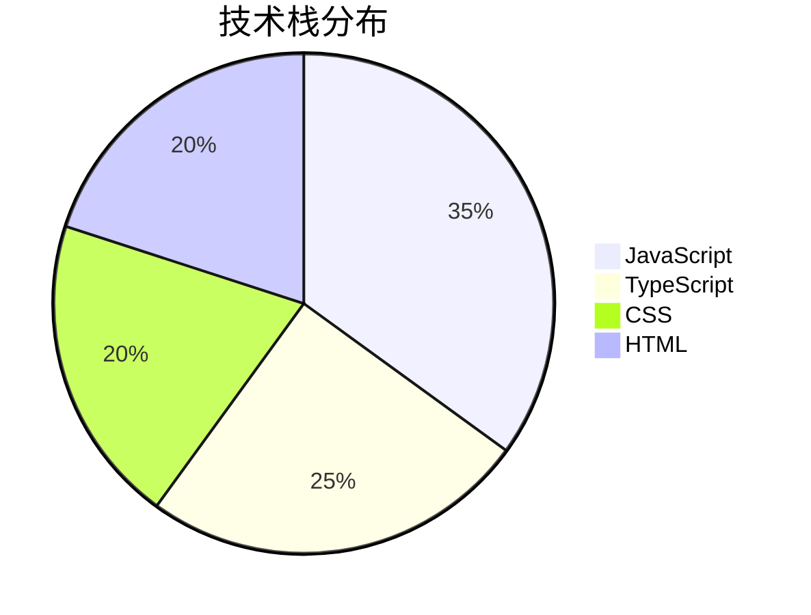

mermaid 图表支持

## 图表示例

### 流程图

```mermaid
graph LR
    A[开始] --> B{条件判断}
    B -->|条件1| C[处理1]
    B -->|条件2| D[处理2]
    C --> E[结束]
    D --> E
```

### 序列图

```mermaid
sequenceDiagram
    participant 用户
    participant 浏览器
    participant 服务器
    participant 数据库
    
    用户->>浏览器: 输入网址
    浏览器->>服务器: 发送HTTP请求
    服务器->>数据库: 查询数据
    数据库-->>服务器: 返回数据
    服务器-->>浏览器: 返回HTML
    浏览器-->>用户: 显示页面
```

### 类图

```mermaid
classDiagram
    class Animal {
        +String name
        +int age
        +makeSound()
    }
    
    class Dog {
        +String breed
        +bark()
    }
    
    class Cat {
        +String color
        +meow()
    }
    
    Animal <|-- Dog
    Animal <|-- Cat
```

### 甘特图

```mermaid
gantt
    title 项目开发时间线
    dateFormat  YYYY-MM-DD
    section 需求分析
    需求收集           :a1, 2025-08-01, 2025-08-05
    需求整理           :a2, after a1, 3d
    section 设计阶段
    UI设计            :b1, 2025-08-08, 7d
    数据库设计         :b2, 2025-08-08, 5d
    section 开发阶段
    前端开发          :c1, 2025-08-15, 14d
    后端开发          :c2, 2025-08-15, 10d
    section 测试阶段
    功能测试          :d1, after c1, 5d
    性能测试          :d2, after d1, 3d
```

### 饼图

```mermaid
pie
    title 技术栈分布
    "JavaScript" : 35
    "TypeScript" : 25
    "CSS" : 20
    "HTML" : 20
```
